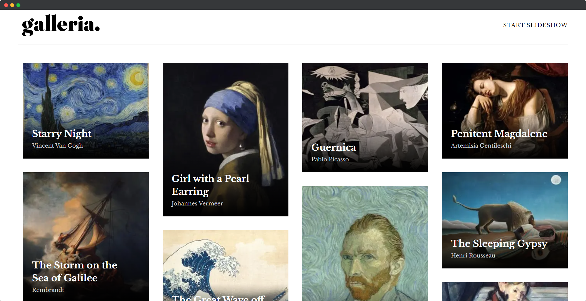

# Frontend Mentor - Galleria slideshow site solution

This is a solution to the [Galleria slideshow site challenge on Frontend Mentor](https://www.frontendmentor.io/challenges/galleria-slideshow-site-tEA4pwsa6). Frontend Mentor challenges help you improve your coding skills by building realistic projects.

## Table of contents

- [Overview](#overview)
  - [The challenge](#the-challenge)
  - [Screenshot](#screenshot)
  - [Links](#links)
- [My process](#my-process)
  - [Built with](#built-with)
  - [What I learned](#what-i-learned)
  - [Continued development](#continued-development)
  - [Useful resources](#useful-resources)
- [Author](#author)

**Note: Delete this note and update the table of contents based on what sections you keep.**

## Overview

### The challenge

Users should be able to:

- View the optimal layout for the app depending on their device's screen size
- See hover states for all interactive elements on the page
- Navigate the slideshow and view each painting in a lightbox

### Screenshot

### Links

- Solution URL: [Add solution URL here](https://github.com/alexisdlr/galleria-nextjs-app)
- Live Site URL: [Add live site URL here](https://galleria-nextjs-app.vercel.app/)

## My process

### Built with

- [Next.js](https://nextjs.org/) - React framework
- [React](https://reactjs.org/) - JS library
- [TailwindCSS](https://tailwind.com/) - For styles
- [Yet another react lightbox](https://yet-another-react-lightbox.com/) - for Lightbox
- [Framer Motion](https://www.framer.com/motion/) - For animations
- Masonry Layout
- Flexbox
- CSS Grid

### What I learned

Actually this challenge was relatively simple but I did learn some new things:

 <ul>
    <li>How to make a masonry layout, I learned it using the react-masonry-css library.</li>
    <li>How to make a lightbox with yet-another-react-lightbox.</li>
 </ul>

### Continued development

In future projects I would like to improve on how to handle the css absolute and relative properties, also to investigate techniques to improve the performance of applications using nextjs.

### Useful resources

- [Yet another react lightbox](https://yet-another-react-lightbox.com/) - This library I used to lightbox, helped me very much.
- [Masonry Layout](https://github.com/paulcollett/react-masonry-css#readme) - This is an amazing library for build the masonry layout very easy.

## Author

- Website - [Alexis De Leon](https://alxs-blog.vercel.app/)
- Frontend Mentor - [@alexisdlr](https://www.frontendmentor.io/profile/alexisdlr)

